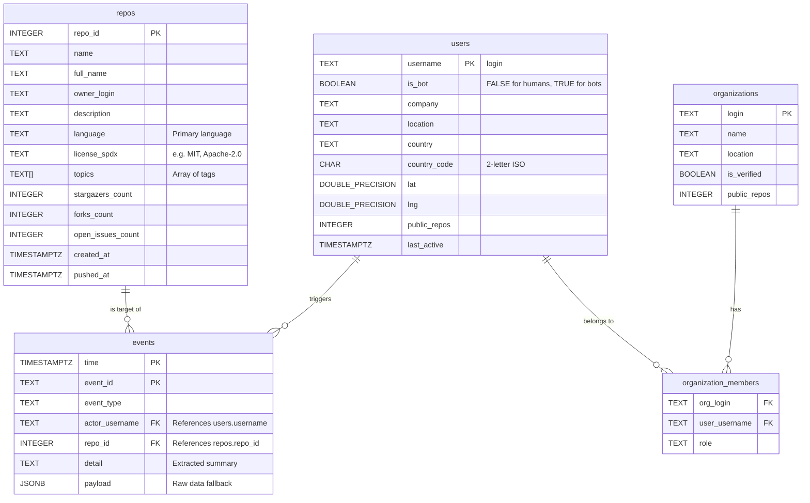

# GitHub Insights

Streaming pipeline that ingests the GitHub public events API into Kafka,
enriches each event with geographic + profile data, stores everything in
TimescaleDB, and surfaces trends live via a Next.js dashboard and Grafana.

---

## 🌐 Live Demo

> **The dashboard is currently running** and can be accessed at:
>
> **[https://github-insights.gampegia.dev/](https://github-insights.gampegia.dev/)**
>
> The instance will remain live until the end of the semester, when the VM is shut down.
> To obtain the password, contact **[gampegia@students.zhaw.ch](mailto:gampegia@students.zhaw.ch)**.
>
> Read the **[project blog post](https://bdp26.github.io/2026/05/21/github-insights.html)** for an overview of the pipeline architecture, results at scale, and the Hidden Gems discovery engine.

---

## Architecture

```
GitHub API
    │  (poll every 10 s)
    ▼
┌─────────────────────────────────────┐
│  Producer  (producer/producer.py)   │
│  • Deduplicates by event ID         │
│  • Publishes raw JSON to Kafka      │
└──────────────┬──────────────────────┘
               │  topic: github.events.raw
               ▼
┌─────────────────────────────────────┐
│  Kafka  (KRaft, no Zookeeper)       │
│  • Broker + Controller in one node  │
│  • Snappy compression               │
│  • 48 h retention / 512 MB cap      │
└──────────────┬──────────────────────┘
               │  consumer group: github-events-enricher
               ▼
┌─────────────────────────────────────┐
│  Consumer  (consumer/consumer.py)   │
│  • Fetches GitHub user/repo data    │
│  • Writes enriched rows to DB       │
│  • Background thread: geocodes      │
│    location strings via local       │
│    Photon without blocking Kafka    │
│  • Supports 1 or 3 instances        │
│    (partition-pinned via assign())  │
└──────────────┬──────────────────────┘
               │
               ▼
┌─────────────────────────────────────┐
│  TimescaleDB  (PostgreSQL + TSE)    │
│                                     │
│  events          ← hypertable       │
│                    1-day chunks     │
│                    7-day compress   │
│                    90-day retention │
│                                     │
│  event_stats_5m  ← continuous agg  │
│  country_ids_5m  ← continuous agg  │
│  actor_stats_1h  ← continuous agg  │
└──────────┬─────────────┬────────────┘
           │             │
           ▼             ▼
┌──────────────┐  ┌──────────────────┐
│  FastAPI     │  │  Grafana  :3001  │
│  :8000       │  │  • Time-series   │
│  REST + SSE  │  │  • World-map     │
└──────┬───────┘  │  • Top repos     │
       │          └──────────────────┘
       ▼
┌──────────────────────────────────────┐
│  Next.js Frontend  :3000             │
│  • KPI cards + commit trend chart    │
│  • Top repos bar chart               │
│  • Live event stream (SSE)           │
└──────────────────────────────────────┘

Debug UI: Kafka-UI  :8080
```



---

## Services overview

| Service | Port | Description |
|---|---|---|
| **frontend** | 3000 | Next.js dashboard with live event stream |
| **api** | 8000 | FastAPI: REST endpoints + SSE stream |
| **grafana** | 3001 | Grafana dashboards (admin / admin) |
| **kafka-ui** | 8080 | Kafka topic browser |
| **timescaledb** | 5432 | TimescaleDB (PostgreSQL 16) |
| **kafka** | 9092 / 9094 | Kafka broker (KRaft) |

---

## Quick start

### Prerequisites

- [Docker](https://docs.docker.com/get-docker/) with the Compose plugin (`docker compose version`)

### 1. Clone and enter the repo

```bash
git clone https://github.com/BDP26/pm4-github-insights.git
cd pm4-github-insights
```

### 2. Configure environment

```bash
cp .env.example .env
```

Open `.env` and optionally add GitHub tokens (strongly recommended; increases rate limit from 60 to 5 000 req/h):

```dotenv
GITHUB_TOKEN_EVENTS=ghp_your_token_here   # producer: poll public events API
GITHUB_TOKEN_USER=ghp_your_token_here     # consumer: fetch user profiles
GITHUB_TOKEN_REPO=ghp_your_token_here     # consumer: fetch repo metadata
```

### 3. Build and start all services

```bash
docker compose --profile single-consumer up --build
```

First start takes a few minutes while images are pulled and built.
Kafka topic creation and DB schema initialisation happen automatically.

> **Multi-instance mode**: to run 3 partition-pinned consumer instances in parallel (useful when consumer lag is building up):
> ```bash
> docker compose --profile multi-consumer up --build
> ```

### 4. Open the UIs

| URL | What you see |
|---|---|
| http://localhost:3000 | Next.js live dashboard |
| http://localhost:8000/docs | FastAPI interactive docs |
| http://localhost:3001 | Grafana (admin / admin) |
| http://localhost:8080 | Kafka-UI |

### 5. Stop everything

```bash
docker compose down          # stop containers, keep volumes
docker compose down -v       # stop containers AND delete all data
```

---

## Docker commands: when to use what

### After changing Python code (consumer or producer)

Rebuild only the affected container; infrastructure stays up, data is preserved.

```bash
# Consumer changed (consumer/consumer.py or consumer/Dockerfile)
docker compose --profile single-consumer up -d --build consumer
# Consumer changed (consumer/consumer.py or consumer/Dockerfile)
docker compose --profile multi-consumer down -v
docker compose --profile multi-consumer up -d --build

# Producer changed (producer/producer.py or producer/Dockerfile)
docker compose up -d --build producer

# Both changed
docker compose --profile single-consumer up -d --build consumer producer
```

### After changing Grafana dashboards / provisioning

Grafana config is mounted as a volume; just restart the container, no rebuild needed.

```bash
docker compose restart grafana
```

### After changing db/init.sql (fresh DB only)

`init.sql` only runs when the DB volume is created for the first time. To apply changes to a **running** DB, write a migration script instead (see below). To apply to a **fresh** DB:

```bash
docker compose down -v                                    # deletes all data
docker compose --profile multi-consumer up --build       # re-creates DB with new schema
```

### Applying a DB migration to a running stack

Migration scripts live in `db/migrations/`. Apply them directly against the running TimescaleDB container without touching other services:

```bash
docker exec -i timescaledb psql -U github -d github_events \
  < db/migrations/001_add_is_bot_to_users.sql
```

Verify the migration ran cleanly: look for `ALTER TABLE`, `CREATE ...` lines and no `ERROR:` lines.

### Full teardown and rebuild (e.g. after infra changes)

```bash
docker compose down                                        # keep volumes (preserves DB data)
docker compose --profile single-consumer up --build        # rebuild all images

# OR: start completely fresh (deletes all data)
docker compose down -v
docker compose --profile single-consumer up --build
```

### Viewing logs

```bash
docker logs -f github-consumer          # follow consumer logs
docker logs -f github-producer          # follow producer logs
docker logs github-consumer --tail 50   # last 50 lines only
```

### Opening a psql session

```bash
docker exec -it timescaledb psql -U github -d github_events
```

---

## API endpoints

| Method | Path | Description |
|---|---|---|
| GET | `/health` | Health check |
| GET | `/api/kpis` | Key metrics (total events, active repos, …) |
| GET | `/api/commits-over-time?days=30` | Commit trend (daily buckets) |
| GET | `/api/top-repos?limit=10` | Most active repositories |
| GET | `/api/recent-events?limit=20` | Latest events |
| GET | `/stream/events` | Server-Sent Events live stream |

---

## Useful SQL queries

```bash
# Open a psql session inside the container
docker exec -it timescaledb psql -U github -d github_events
```

```sql
-- Most active repos in the last 24 hours (human actors only)
SELECT * FROM v_top_repos_24h LIMIT 10;

-- Geographic distribution of events (bots excluded)
SELECT * FROM v_geo_events LIMIT 20;

-- Most active actor today
SELECT actor_username, sum(event_count)
FROM actor_stats_1h
WHERE bucket > now() - INTERVAL '24 hours'
GROUP BY actor_username
ORDER BY sum DESC
LIMIT 10;

-- Raw payload inspection
SELECT time, actor_username, event_type, payload->'commits'->0->>'message' AS commit_msg
FROM events
WHERE event_type = 'PushEvent'
ORDER BY time DESC
LIMIT 20;

-- Bot activity vs human activity breakdown
SELECT
    u.is_bot,
    count(e.event_id) AS total_events,
    count(DISTINCT e.actor_username) AS unique_actors
FROM events e
JOIN users u ON e.actor_username = u.username
WHERE e.time > now() - INTERVAL '24 hours'
GROUP BY u.is_bot;

-- List all known bots
SELECT username, fetched_at FROM users WHERE is_bot = TRUE ORDER BY fetched_at DESC;
```

---

## Why these technology choices?

### Kafka (message bus)

- Decouples the rate-limited GitHub poller from the slow geo-enrichment step
- Allows multiple consumers (e.g. add a Flink job later without touching the producer)
- Acts as a durable replay buffer: if the consumer crashes, it picks up where it left off

### TimescaleDB (storage): not plain Postgres, not Neo4j

| Option | Verdict |
|---|---|
| Plain PostgreSQL | Missing time-series indexes & compression; gets slow at scale |
| **TimescaleDB** ✅ | Hypertables = automatic chunking by time. 10-20× compression. Continuous aggregates pre-compute rollups. First-class Grafana support |
| InfluxDB | Good for pure metrics but no SQL, weak JOIN support for enrichment queries |
| Graph DB (Neo4j) | Excellent for "actor→repo→org" relationship queries but overkill here; you'd need a second DB for time-series anyway |
| Cassandra | Good for write-heavy scale, but complex ops and no aggregation |

**Verdict**: TimescaleDB gives you all of PostgreSQL (rich SQL, JOINs, JSONB for payloads) plus time-series superpowers.

### Grafana (visualisation)

- Native TimescaleDB/PostgreSQL data source
- World-map panel for geo distribution
- Auto-refresh every 10 s matches the poll interval
- No extra backend needed; Grafana queries the continuous aggregates directly

---

## Scaling up

| Need | Solution |
|---|---|
| More throughput | Add Kafka broker nodes, increase partitions |
| Faster enrichment | Run 3 partition-pinned consumer instances: `docker compose --profile multi-consumer up -d` |
| Stream processing | Add Apache Flink or Spark Structured Streaming consuming from Kafka |
| Long-term archival | Add a Kafka connector to dump to S3/GCS (Parquet) |
| Alerts | Use Grafana alerting rules on the continuous aggregates |
