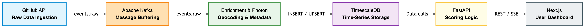
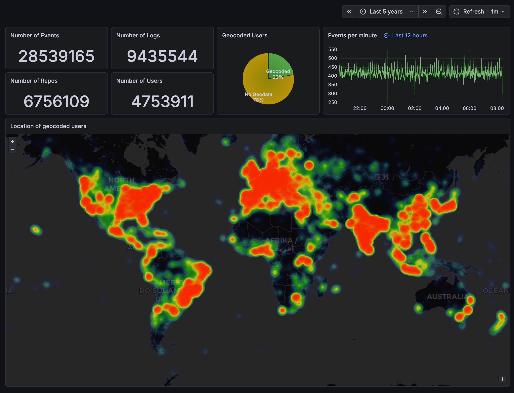
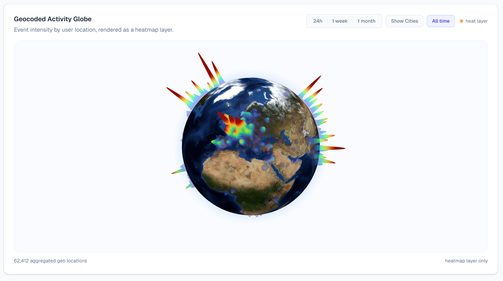
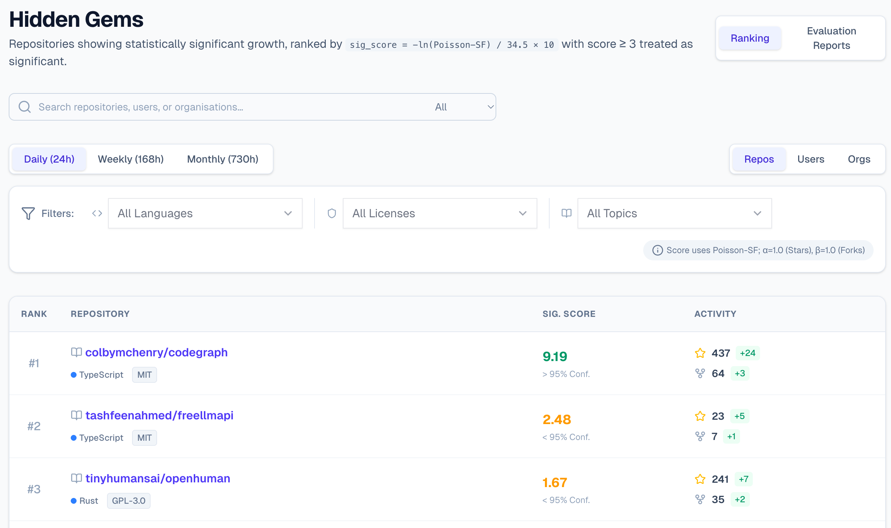

# Discovering Hidden Gems: Real-Time Open-Source Trend Analytics on GitHub

*By Jann Erhardt, Gian Gamper & Jonas Bratschi*

The open-source ecosystem hosted on GitHub is growing relentlessly. Every single day, millions of push events, pull requests, and repository forks are published. This massive volume of data presents a paradox: the sheer richness of the signal makes it practically impossible to manually track and discover emerging projects before they appear in mainstream media.

Existing discovery mechanisms, like GitHub's own Trending page, often rely on lagging indicators—such as stars accumulated over weeks—rather than on the raw momentum visible in the live event stream. That is exactly why we built the **GitHub Innovation Portal**: an end-to-end streaming analytics platform that continuously ingests the GitHub public events API, enriches the data, and instantly surfaces statistically significant growth trends.

### Our Architecture at a Glance

To process these high-velocity data streams with sub-second latency, we designed a fully decoupled, containerized system. 

As illustrated in the flowchart above, the data processing follows a streamlined, linear progression. It begins with the **GitHub API** handling the *Raw Data Ingestion*, which passes the `events.raw` data to **Apache Kafka** for secure *Message Buffering*. Next, the raw events flow into the **Enrichment & Photon** module for *Geocoding & Metadata* addition, which then performs an `INSERT / UPSERT` operation to load the enriched records into **TimescaleDB** for *Time-Series Storage*. Finally, **FastAPI** makes `Data calls` to apply the *Scoring Logic* and serves the final output via `REST / SSE` directly to the **Next.js** *User Dashboard*.

A dedicated producer constantly polls the public GitHub Events API, filters out duplicates, and publishes clean records to Apache Kafka, acting as a reliable replay buffer. Parallel consumer instances then fetch these raw events, batching GraphQL queries to enrich them with user and repository metadata. To bypass the strict rate limits of public geocoding services, we integrated a local *Photon* geocoding engine based on OpenStreetMap data. 

### Operational Monitoring via the Admin Dashboard

To maintain real-time situational awareness over the pipeline's health, data throughput, and system metrics, we utilize an operational monitoring layer powered by Grafana.

A live snapshot from this administrative panel highlights the true scale of our pipeline execution: the system has successfully processed a staggering **28,539,165 events** across **6,756,109 distinct repositories**. Furthermore, profile records for **4,753,911 unique users** have been compiled alongside **9,435,544 operational logs**. The backend heatmap provides system operators with an immediate, striking visualization of where these developers are located globally.

### Bringing Data to Life: The User Frontend

While the admin panel monitors backend metrics and system health, our interactive Next.js user interface transforms these raw data numbers into an intuitive discovery tool for developers and tech scouts.

#### Global Geocoded Activity

By combining fuzzy-search capabilities with our local Photon setup, the pipeline achieves an outstanding **98.0% geocoding success rate** across 217 represented countries. The interactive 3D activity globe maps this user intensity in real-time, displaying developer event volumes as dynamic, colorful heatmap peaks erupting across the physical geography of the planet.

#### Identifying True "Hidden Gems"

The core analytical layer of our application is the "Hidden Gems" discovery engine. Rather than ranking repositories solely on naive, cumulative star counts—which naturally biases results toward established software giants—our model uses a **Poisson significance test**.

We define a repository's momentum by monitoring weighted star and fork actions within a chosen time frame (24h, 168h, or 730h). The engine then evaluates this activity against an expected growth rate computed from that specific repository's historical baseline. A breakout project is flagged as a true hidden gem only if its sudden growth spike becomes statistically anomalous under the null model, requiring a significance score of $\ge$ 3.0. Through the user dashboard, tech scouts can effortlessly apply granular filters across programming languages, topics, and software licenses to uncover cutting-edge work before it trends anywhere else.

### Conclusion

By shifting away from static, lagging lists and fully embracing stateful stream processing paired with localized enrichment, the GitHub Innovation Portal proves that it is still possible to reclaim full control over public internet discourse—spotting open-source breakthroughs the very moment they accelerate.