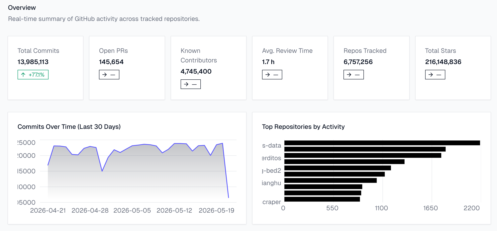

Every day, millions of push events, pull requests, and repository forks flood GitHub's public event stream. Buried in that noise is tomorrow's most popular open-source library, but by the time it surfaces on [GitHub's Trending page](https://github.com/trending), the momentum has already peaked.

We built **GitHub Insights** to catch breakout projects the moment they accelerate, not weeks later.

### From GitHub API to Dashboard in Five Steps

The system is a fully containerized, event-driven pipeline. Rather than batch-processing nightly snapshots, it continuously ingests the [GitHub public events API](https://docs.github.com/en/rest/activity/events), polling every 10 seconds, and processes each event through five stages:

- **Producer** polls the GitHub Events API, deduplicates records, and publishes clean events to Apache Kafka.
- **Apache Kafka** (KRaft mode) acts as a durable message buffer, retaining events for 48 hours so no data is lost if a consumer fails.
- **Consumer** fetches raw events from Kafka and enriches them with user and repository metadata via batched GraphQL queries.
- **TimescaleDB** stores enriched records in hypertables with pre-computed continuous aggregates for fast time-range queries.
- **FastAPI** applies scoring logic and serves results via REST and Server-Sent Events to the **Next.js** dashboard.

To sidestep the strict rate limits of public geocoding services, we run a local *Photon* geocoder (an [OpenStreetMap-based engine](https://photon.komoot.io/)) inside the same Docker stack, keeping enrichment fast without external dependencies.

### 28 Million Events Later: What the Numbers Show

A Grafana monitoring layer gives the team live visibility into pipeline health and throughput.

After several weeks of continuous operation, the pipeline had processed:

- **28,539,165** raw GitHub events
- **6,756,109** distinct repositories tracked
- **4,753,911** unique developer profiles compiled
- **9,435,544** operational log entries

All of this runs on a single virtualised server with 16 vCPUs and 31 GiB of RAM, with no distributed cloud cluster required.

### Who Codes Where? A Planet of Open-Source Activity

Every event is linked to a geographic location. Using our local Photon geocoder, the pipeline achieves a **98.0% geocoding success rate** across 217 countries. The result is an interactive 3D globe that maps developer activity as heatmap peaks, showing where open-source momentum is building around the world.

### Finding Tomorrow's Libraries Before They Trend

The heart of GitHub Insights is the **Hidden Gems** discovery engine. Most ranking systems sort repositories by total star count, which means established giants always dominate. We took a different approach.

> *A small Rust library that normally receives 2 forks per week and suddenly gets 40 in a single day is statistically extraordinary, even if it only has 300 stars total. That is exactly the signal we are looking for.*

Our model applies a **Poisson significance test**: it measures a repository's recent star and fork activity against its own historical baseline. A project is flagged as a hidden gem only when its growth spike is statistically anomalous, requiring a significance score **≥ 3.0**. Scouts can filter results by time window (1 day / 1 week / 1 month), programming language, topic, or license.

### The Signal Was Always There

GitHub's event stream already contains everything needed to spot tomorrow's breakout projects. The challenge is processing it continuously, at scale, and with enough statistical rigour to separate genuine momentum from noise. That is exactly what GitHub Insights does.

**Want to run it yourself?** The full source code and setup instructions are on [GitHub](https://github.com/BDP26/pm4-github-insights). Curious about more student data engineering projects? Browse all summaries at [bdp26.github.io](https://bdp26.github.io/).
